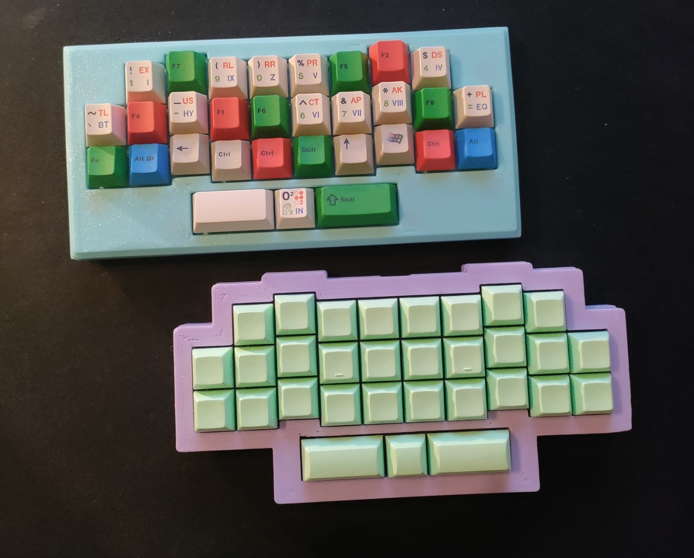
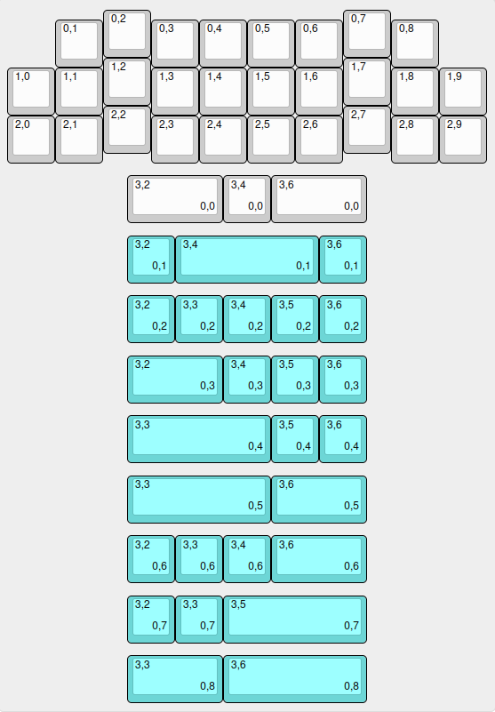

## BIG DISCLAIMER
Out of the 10 pcbs I ordered, 2 don't work!\
I don't recommend anyone use these files for production in their current state, proceed at your own risk.\
The purpose of this repo is to document this keyboards existence, this is meant to be a one-off board for me and I don't intend to make another (hopefully fixed) version in the near future so unfortunately it is stuck in this kind of not working state.

im summary:
DON'T USE THESE FILES THEY MAY BE BROKEN IN UNKNOWN WAYS

## check it out

note: The rectangular case is not included in this repo because it is embarrassingly constructed, but I plan to make a rectangular version that is better.
## Layout 
\
[KLE](http://www.keyboard-layout-editor.com/##@_name=zodj%C3%B6d&author=ulog4l%3B&@_y:0.05&x:2%3B&=0,2&_x:4%3B&=0,7%3B&@_y:-0.8&x:1%3B&=0,1&_x:1%3B&=0,3&=0,4&=0,5&=0,6&_x:1%3B&=0,8%3B&@_y:-0.19999999999999996&x:2%3B&=1,2&_x:4%3B&=1,7%3B&@_y:-0.7999999999999998%3B&=1,0&=1,1&_x:1%3B&=1,3&=1,4&=1,5&=1,6&_x:1%3B&=1,8&=1,9%3B&@_y:-0.20000000000000018&x:2%3B&=2,2&_x:4%3B&=2,7%3B&@_y:-0.7999999999999998%3B&=2,0&=2,1&_x:1%3B&=2,3&=2,4&=2,5&=2,6&_x:1%3B&=2,8&=2,9%3B&@_y:0.25&x:2.5&w:2%3B&=3,2%0A%0A%0A0,0&=3,4%0A%0A%0A0,0&_w:2%3B&=3,6%0A%0A%0A0,0%3B&@_y:0.25&x:2.5&c=%236dd6d6%3B&=3,2%0A%0A%0A0,1&_w:3%3B&=3,4%0A%0A%0A0,1&=3,6%0A%0A%0A0,1%3B&@_y:0.25&x:2.5%3B&=3,2%0A%0A%0A0,2&=3,3%0A%0A%0A0,2&=3,4%0A%0A%0A0,2&=3,5%0A%0A%0A0,2&=3,6%0A%0A%0A0,2%3B&@_y:0.25&x:2.5&w:2%3B&=3,2%0A%0A%0A0,3&=3,4%0A%0A%0A0,3&=3,5%0A%0A%0A0,3&=3,6%0A%0A%0A0,3%3B&@_y:0.25&x:2.5&w:3%3B&=3,3%0A%0A%0A0,4&=3,5%0A%0A%0A0,4&=3,6%0A%0A%0A0,4%3B&@_y:0.25&x:2.5&w:3%3B&=3,3%0A%0A%0A0,5&_w:2%3B&=3,6%0A%0A%0A0,5%3B&@_y:0.25&x:2.5%3B&=3,2%0A%0A%0A0,6&=3,3%0A%0A%0A0,6&=3,4%0A%0A%0A0,6&_w:2%3B&=3,6%0A%0A%0A0,6%3B&@_y:0.25&x:2.5%3B&=3,2%0A%0A%0A0,7&=3,3%0A%0A%0A0,7&_w:3%3B&=3,5%0A%0A%0A0,7%3B&@_y:0.25&x:2.5&w:2%3B&=3,3%0A%0A%0A0,8&_w:3%3B&=3,6%0A%0A%0A0,8)\
note: If you happen to like this layout I do fully support you making your own board that uses it(or just forking this one).\
The two layout options I retrospectively would add are support for a vertical 2U numpad Enter key on the right and a 1211U bottom row.\
All the 3U opions have turned out to be useless since 3U stab wires are impossible to actually purchase. 

## PCB
it looks like this\

