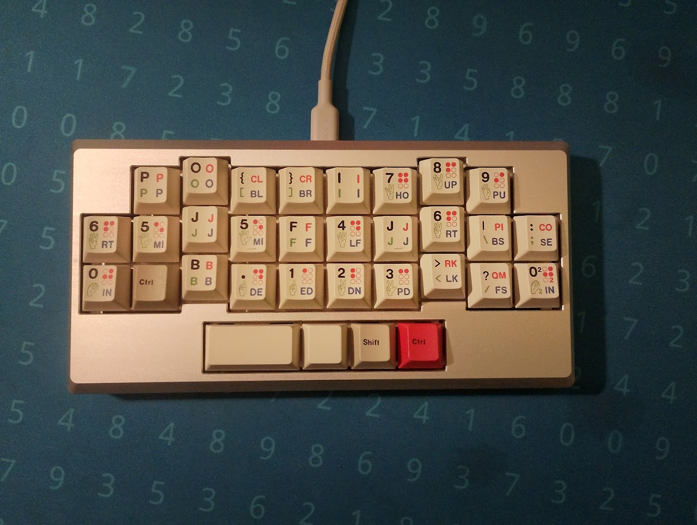
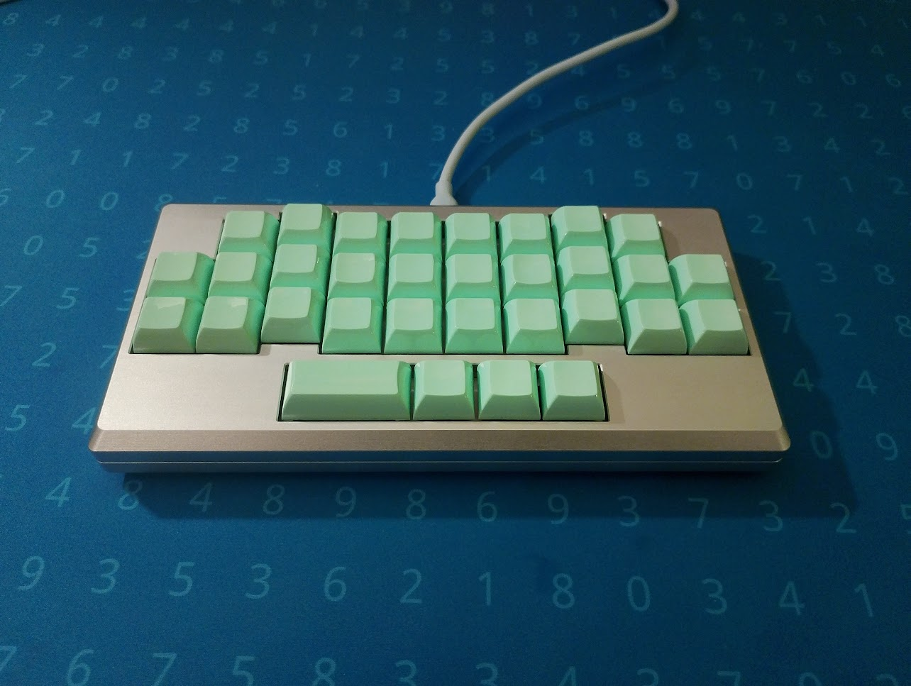
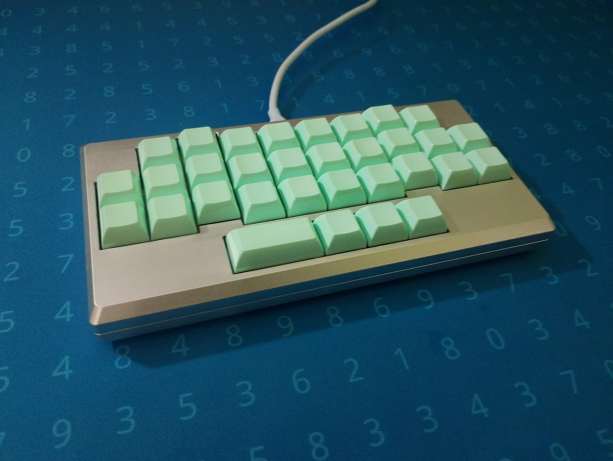
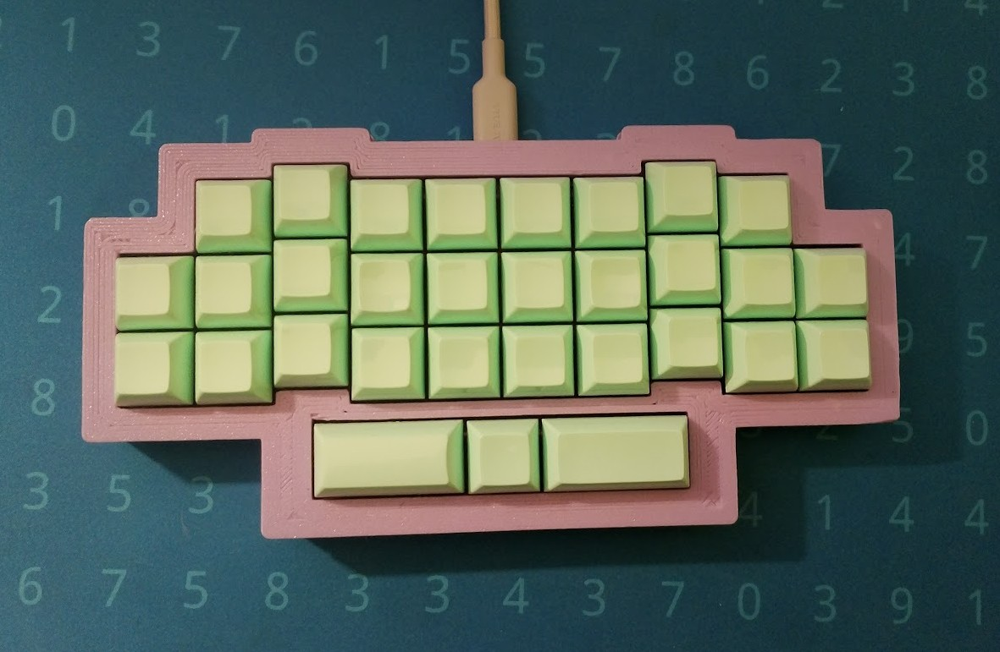
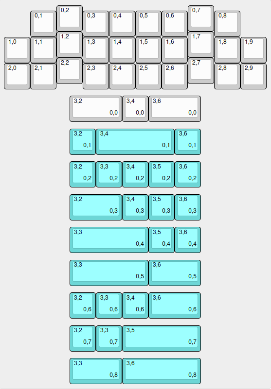

## BIG DISCLAIMER
Out of the 10 pcbs I ordered, 2 simply don't work!\
I don't know enough about pcb manufacturing or kicad to determine what went wrong or if this is my fault.\
I'm not responsible if you use these files and they don't work, you have been warned.
 

## CNC alu case
case designed for CNC manufacturing featuring a 23mm height, no angle, [geon tadpole](https://geon.works/products/tadpole?variant=42514434621603) mount and [SKUF](https://github.com/Zambumon/SKUF) feet
\
\
\

## 3DP case

## Layout 
\
[KLE](http://www.keyboard-layout-editor.com/##@_name=zodj%C3%B6d&author=ulog4l%3B&@_y:0.05&x:2%3B&=0,2&_x:4%3B&=0,7%3B&@_y:-0.8&x:1%3B&=0,1&_x:1%3B&=0,3&=0,4&=0,5&=0,6&_x:1%3B&=0,8%3B&@_y:-0.19999999999999996&x:2%3B&=1,2&_x:4%3B&=1,7%3B&@_y:-0.7999999999999998%3B&=1,0&=1,1&_x:1%3B&=1,3&=1,4&=1,5&=1,6&_x:1%3B&=1,8&=1,9%3B&@_y:-0.20000000000000018&x:2%3B&=2,2&_x:4%3B&=2,7%3B&@_y:-0.7999999999999998%3B&=2,0&=2,1&_x:1%3B&=2,3&=2,4&=2,5&=2,6&_x:1%3B&=2,8&=2,9%3B&@_y:0.25&x:2.5&w:2%3B&=3,2%0A%0A%0A0,0&=3,4%0A%0A%0A0,0&_w:2%3B&=3,6%0A%0A%0A0,0%3B&@_y:0.25&x:2.5&c=%236dd6d6%3B&=3,2%0A%0A%0A0,1&_w:3%3B&=3,4%0A%0A%0A0,1&=3,6%0A%0A%0A0,1%3B&@_y:0.25&x:2.5%3B&=3,2%0A%0A%0A0,2&=3,3%0A%0A%0A0,2&=3,4%0A%0A%0A0,2&=3,5%0A%0A%0A0,2&=3,6%0A%0A%0A0,2%3B&@_y:0.25&x:2.5&w:2%3B&=3,2%0A%0A%0A0,3&=3,4%0A%0A%0A0,3&=3,5%0A%0A%0A0,3&=3,6%0A%0A%0A0,3%3B&@_y:0.25&x:2.5&w:3%3B&=3,3%0A%0A%0A0,4&=3,5%0A%0A%0A0,4&=3,6%0A%0A%0A0,4%3B&@_y:0.25&x:2.5&w:3%3B&=3,3%0A%0A%0A0,5&_w:2%3B&=3,6%0A%0A%0A0,5%3B&@_y:0.25&x:2.5%3B&=3,2%0A%0A%0A0,6&=3,3%0A%0A%0A0,6&=3,4%0A%0A%0A0,6&_w:2%3B&=3,6%0A%0A%0A0,6%3B&@_y:0.25&x:2.5%3B&=3,2%0A%0A%0A0,7&=3,3%0A%0A%0A0,7&_w:3%3B&=3,5%0A%0A%0A0,7%3B&@_y:0.25&x:2.5&w:2%3B&=3,3%0A%0A%0A0,8&_w:3%3B&=3,6%0A%0A%0A0,8)\
note: some of these bottom row opions are pretty stupid and not actually supported by the plates in this repo\
(also note the middle finger columns are staggered by .2U instead of .25U, this is very important)

## PCB

